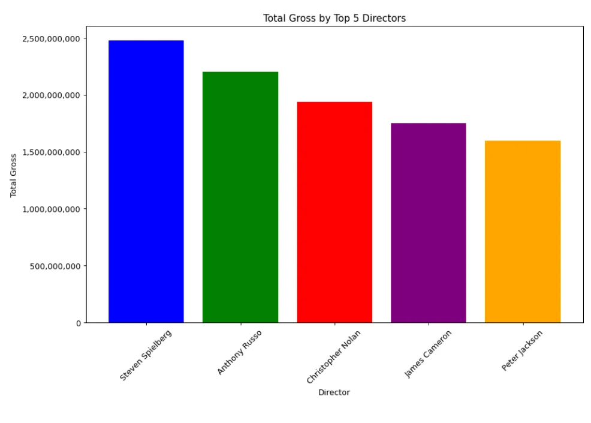
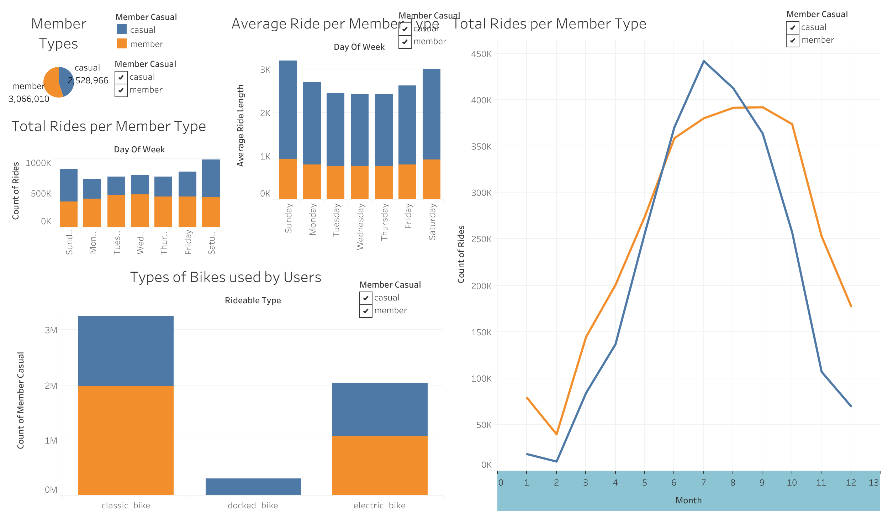

# Data Analyst
**Techincal Skills: SQL, Tableau, Python, R, Excel**

### Projects
[IMDb Top 1000](https://github.com/pratikspatel813/Movies-Project)  
- Queried through 1000 data points to determine the genre combination, Action & Adventure, as the formula for high-grossing films.  
- Utilized Python libraries such Pandas, Matplotlib, & Seaborn to clean and visualize the data.

#### Total Gross by Top 5 Directors

[Google Capstone Project](https://github.com/pratikspatel813/Divvy-Data-Project)  
- Applied data analytics skills and tools like R, Tableau, and Excel for a Google Data Analytics Certificate capstone project.  
- Discovered metrics such as the count of paid members (3 million) and the average sum of ride frequency per day (800 minutes).  
- Data wrangled with 12 different data sources into a consolidated dataset for analysis.

#### Tableau Dashboard

[Apple App Store Analysis](https://github.com/pratikspatel813/AppleAppStore-Project)
- SQL Project focusing on exploratory analysis to discover trends in the Apple App Store.  
- Discovered a correlation between App Description and Rating. The lengthier the description, the higher the rating.  

### Leadership & Volunteer Experience
In 2022, I decided to pause my professional career to pursue a volunteer opportunity. I've had the privilege of volunteering at BAPS Swaminarayan Akshardham. Over 14 months, I contributed to building the second-largest Hindu Temple in the world. You can read more about my journey on my [Medium Page](https://medium.com/@pratikspatel813/akshardham-my-volunteering-journey-47ec08f17e9d).

### Work Experience
Business Intelligence Analyst @ NielsenIQ (_June 2021 - June 2022_)  
Project Management Organization Co-op @ Johnson & Johnson (_January 2020 - July 2020_)

### Education
Rutgers University - Mathematics, BA (_December 2020_)

### Socials
[LinkedIn](https://www.linkedin.com/in/pratikspatel813/)  
[Medium](https://medium.com/@pratikspatel813)  
[pratikspatel813@gmail.com](mailto:pratikspatel813@gmail.com)
